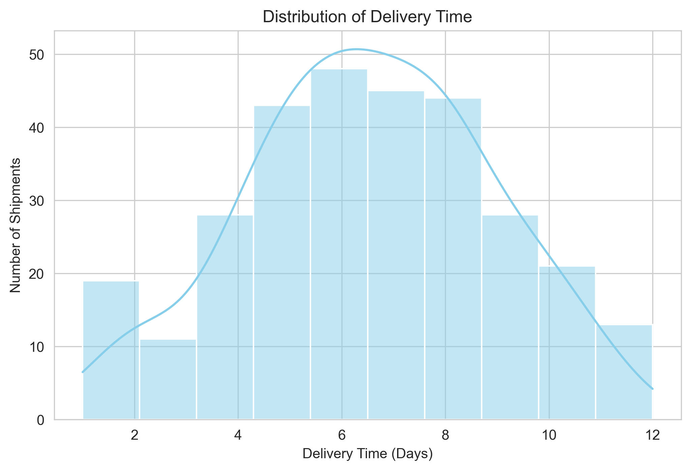
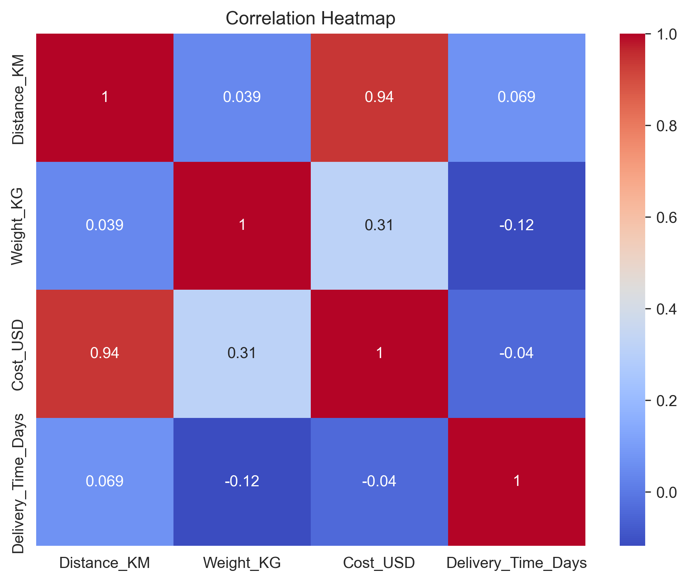

# 🚚 FedEx Delivery Operations – Exploratory Data Analysis

<p align="center">


</p>

---

# 📖 Project Overview

This project presents an **Exploratory Data Analysis (EDA)** of a simulated **FedEx delivery dataset** to uncover shipment trends, evaluate delivery performance, identify operational bottlenecks, and generate actionable business insights for logistics optimization.

Using Python and popular data analysis libraries, the project explores shipment behavior through statistical summaries and visualizations to support data-driven decision-making.

---

# 🎯 Objectives

- Analyze shipment and delivery trends.
- Evaluate delivery performance across shipment modes.
- Identify key factors contributing to delivery delays.
- Study the relationship between shipment distance, weight, and shipping cost.
- Generate business insights for improving logistics operations.
- Recommend strategies to enhance delivery efficiency and customer satisfaction.

---

# 📂 Dataset

The project uses a simulated dataset named **`fedex_deliveries.csv`** containing shipment information.

| Feature | Description |
|----------|-------------|
| ShipmentID | Unique shipment identifier |
| Origin | Origin city |
| Destination | Destination city |
| Pickup_Date | Shipment pickup date |
| Delivery_Date | Shipment delivery date |
| Delivery_Status | Delivered, Delayed, In Transit |
| Distance_KM | Shipment distance |
| Shipment_Mode | Air, Ground, Freight |
| Weight_KG | Shipment weight |
| Cost_USD | Shipping cost |
| Customer_Segment | Business, Retail, Government |
| Delay_Reason | Weather, Operational, Customs, None |

---

# 🛠️ Technologies Used

- Python
- Jupyter Notebook
- Pandas
- NumPy
- Matplotlib
- Seaborn
- Git
- GitHub

---

# 📊 Project Workflow

- Imported the dataset.
- Explored data structure and summary statistics.
- Checked missing values and duplicate records.
- Converted date columns into datetime format.
- Created delivery duration feature.
- Performed descriptive statistical analysis.
- Conducted univariate analysis.
- Performed bivariate analysis.
- Generated correlation analysis.
- Created informative visualizations.
- Derived business insights.
- Proposed recommendations.

---

# 📈 Key Visualizations

The notebook includes the following visualizations:

- Delivery Time Distribution
- Shipment Mode Distribution
- Average Shipping Cost by Customer Segment
- Delivery Status Distribution
- Weight vs Shipping Cost
- Top Origin–Destination Routes
- Delivery Status by Shipment Mode
- Correlation Heatmap
- Delay Reason Analysis
- Average Delivery Time by Shipment Mode

---

# 📸 Project Preview

> Add your generated charts here after uploading them to the repository.

Example:

```markdown



```

---

# 🔍 Key Insights

- Air shipments generally achieve faster delivery compared to Ground and Freight shipments.
- Shipping cost increases with shipment distance and package weight.
- Operational issues and weather conditions are major contributors to delivery delays.
- Certain origin–destination routes handle significantly higher shipment volumes.
- Delivery duration differs noticeably across shipment modes.

---

# 💡 Recommendations

- Optimize shipment mode selection based on delivery priority.
- Improve route planning to reduce transportation time.
- Strengthen monitoring of operational and weather-related risks.
- Enhance customer communication through real-time shipment tracking.
- Utilize analytics for proactive logistics planning and resource optimization.

---

# ▶️ Getting Started

## Clone the Repository

```bash
git clone https://github.com/fayaz9100/FedEx_EDA_Project.git
```

## Navigate to the Project Folder

```bash
cd FedEx_EDA_Project
```

## Install Required Libraries

```bash
pip install pandas numpy matplotlib seaborn
```

## Run the Notebook

Open

```
FedEx_EDA.ipynb
```

Run all cells sequentially.

---

# 📁 Project Structure

```
FedEx_EDA_Project/
│
├── dataset/
│   └── fedex_deliveries.csv
│
├── outputs/
│   ├── delivery_time_distribution.png
│   ├── shipment_mode_bar.png
│   ├── customer_segment_cost.png
│   ├── delivery_status_distribution.png
│   ├── weight_vs_cost.png
│   ├── top_city_pairs.png
│   ├── delays_by_mode.png
│   ├── correlation_heatmap.png
│   ├── delay_reason_analysis.png
│   └── delivery_time_by_mode.png
│
├── FedEx_EDA.ipynb
│
└── README.md
```

---

# 🚀 Future Enhancements

- Develop an interactive Power BI dashboard.
- Build machine learning models for delivery delay prediction.
- Integrate real-time logistics data.
- Automate reporting and dashboard generation.
- Deploy the project as a web application.

---

# 👨‍💻 Author

**Shaik Fayaz Ahammed**

B.Tech – Computer Science & Engineering (Data Science)

GitHub: https://github.com/fayaz9100

LinkedIn: https://www.linkedin.com/in/shaik-fayaz-ahammed/

---

# ⭐ Support

If you found this project useful, please consider **starring ⭐ the repository** and sharing your feedback.
